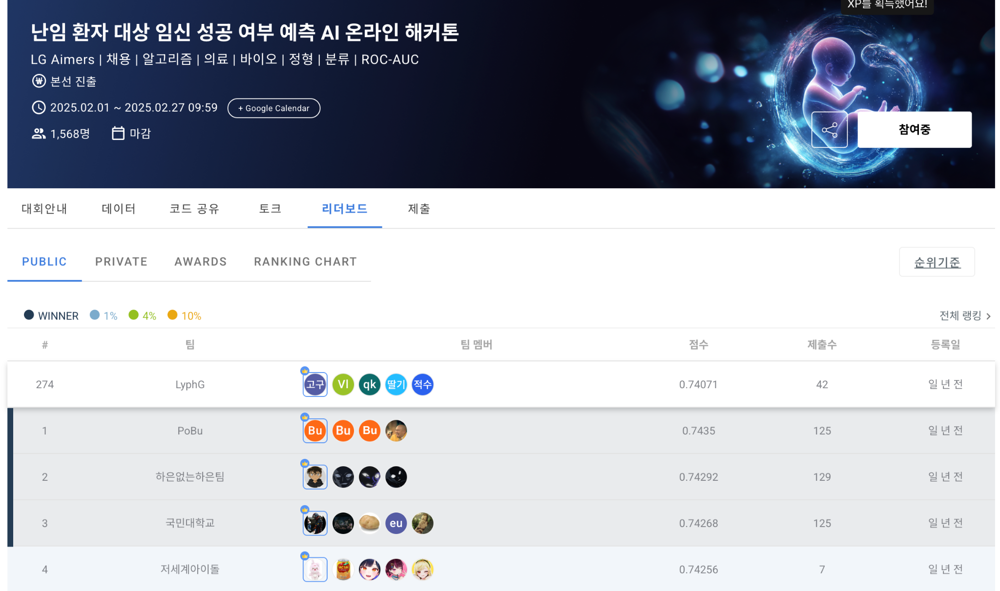

# LG Aimers 6기 | 난임 환자 임신 성공 여부 예측 AI

> 난임 환자의 시술 데이터를 분석해 임신 성공 가능성을 예측하는 AI 모델을 개발한 프로젝트입니다.

- **기간**: 2025.02.01 ~ 2025.02.27
- **대회**: LG Aimers 6기 온라인 해커톤
- **주최**: LG AI연구원
- **주관**: 데이콘
- **문제 유형**: Binary Classification
- **평가 지표**: ROC-AUC
- **Public Score**: **0.74071**

---

## 1. 프로젝트 배경 | 문제

난임 시술은 환자에게 높은 비용과 심리적 부담을 동반하며, 여러 차례의 시술이 필요한 경우도 많습니다.  
따라서 환자의 시술 이력과 난임 원인, 배아·난자·정자 관련 정보를 바탕으로 **임신 성공 가능성을 사전에 예측하고 의사결정을 지원하는 것**이 중요합니다.

이번 해커톤에서는 난임 환자의 시술 데이터를 활용해 임신 성공 여부를 예측하고, 임신 성공에 영향을 줄 수 있는 주요 특성을 탐색하는 것을 목표로 했습니다.

---

## 2. 프로젝트 주제

### 난임 환자 대상 임신 성공 여부 예측 AI 모델 개발

학습 데이터 **256,351건**과 테스트 데이터 **90,067건**의 난임 시술 정보를 활용해, 각 환자의 **임신 성공 확률**을 예측했습니다.

- **Target**
  - `1`: 임신 성공
  - `0`: 임신 실패
- **임신 성공 기준**: 출산까지 성공적으로 진행된 임신
- **평가 방식**: ROC-AUC

---

## 3. 해결 노력

### 3.1 데이터 특성에 맞춘 전처리

원본 데이터에는 범주형 문자열, 결측값, 여러 열에 분산된 유사 정보가 함께 존재했습니다.  
모델이 각 특성을 안정적으로 학습할 수 있도록 데이터의 의미를 기준으로 전처리를 진행했습니다.

#### 횟수형 문자열 수치화
`총 시술 횟수`, `IVF 시술 횟수`, `DI 시술 횟수`, `총 임신 횟수`, `총 출산 횟수` 등 문자열 형태의 횟수 데이터에서 숫자를 추출해 수치형 변수로 변환했습니다.

#### 연령 구간 수치화
`시술 당시 나이`, `난자 기증자 나이`, `정자 기증자 나이`처럼 구간으로 표현된 연령 정보를 구간 내 숫자의 평균값으로 변환했습니다.

#### 시술 유형 재구성
`특정 시술 유형` 문자열을 그대로 사용하는 대신 문자열 구조를 이용해 새로운 특성을 만들었습니다.

- `:` 포함 여부 → **세부 조합 시행 여부**
- `/` 포함 여부 → **복합적인 시술 시행 여부**

#### 배아 생성 목적 파생 변수 생성
`배아 생성 주요 이유`에서 실제 예측에 활용할 수 있도록 목적을 단순화했습니다.

- **현재 시술용 배아 생성 여부**
- **배아/난자 저장 또는 기증 여부**

---

### 3.2 관련 변수를 이용한 결측값 및 정보 보정

결측값을 일괄적으로 처리하기보다 서로 연관된 시술 정보를 함께 확인해 값을 보정했습니다.

#### PGD / PGS 정보 보정
착상 전 유전 검사·진단 여부, 정자 관련 불임 원인, 난자 채취 경과일, 배아 생성 목적 등을 조합해 `PGD 시술 여부`, `PGS 시술 여부`의 일부 결측값을 규칙 기반으로 보정했습니다.

#### 배아 사용 여부 보정
- 해동된 배아 수가 0인 경우 → 동결 배아 사용 여부 보정
- 총 생성 배아 수가 0인 경우 → 신선 배아 사용 여부 보정

#### 난자·정자 출처 정제
기증 배아 사용 여부, 기증자 나이, 파트너 정자와 혼합된 난자 수 등을 활용해 `미할당`, `알 수 없음` 값을 보정했습니다.

이후 `난자 출처`, `정자 출처`는 **One-Hot Encoding**을 적용했습니다.

---

### 3.3 중복된 불임 원인 변수 통합

불임 원인이 여러 세부 열로 분산되어 있어 관련 정보를 다음과 같이 통합했습니다.

- **남성 요인 불임 여부**
- **여성 요인 불임 여부**
- **불명확 원인 불임 여부**

세부 원인들을 하나의 대표 특성으로 묶어 변수 간 중복을 줄이고, 모델이 핵심적인 불임 원인 정보를 학습할 수 있도록 정리했습니다.

---

### 3.4 클래스 불균형 처리

학습용 데이터의 클래스 비율을 확인한 결과 임신 실패 데이터가 성공 데이터보다 크게 많았습니다.

| 구분 | 임신 실패(0) | 임신 성공(1) |
|---|---:|---:|
| Under Sampling 전 | 152,098 | 52,982 |
| Under Sampling 후 | 52,982 | 52,982 |

`RandomUnderSampler`를 적용해 두 클래스의 수를 동일하게 맞추고, 다수 클래스에 치우친 학습을 완화했습니다.

---

### 3.5 Stacking Ensemble 모델 구성

단일 모델보다 서로 다른 트리 기반 모델의 예측 특성을 함께 활용하기 위해 **Stacking Ensemble**을 구성했습니다.

#### Base Models

| Model | 주요 설정 |
|---|---|
| XGBoost | `n_estimators=200`, `learning_rate=0.05`, `max_depth=10` |
| Random Forest | `n_estimators=150`, `max_depth=15` |
| CatBoost | `iterations=200`, `learning_rate=0.05`, `depth=10` |

#### Meta Model

- **Logistic Regression**

각 Base Model의 예측 결과를 Logistic Regression이 다시 학습하도록 구성해 최종 임신 성공 확률을 산출했습니다.

```text
Preprocessed Data
       │
       ├── XGBoost ────────┐
       ├── Random Forest ──┼──> Logistic Regression ──> Pregnancy Probability
       └── CatBoost ───────┘
```

---

## 4. 결과

### Validation

학습 데이터의 80%를 Train, 20%를 Validation으로 분리하고 클래스 비율을 유지해 평가했습니다.

| Metric | Score |
|---|---:|
| **ROC-AUC** | **0.7344** |
| Accuracy | 0.6339 |
| F1-score | 0.5106 |

대회의 핵심 평가 지표가 ROC-AUC인 만큼, 최종 모델은 클래스 예측값이 아니라 **임신 성공 확률**을 산출하도록 구성했습니다.

### Public Leaderboard



| 항목 | 결과 |
|---|---:|
| **Public ROC-AUC** | **0.74071** |
| Public Rank | 274위 |
| 제출 횟수 | 42회 |

참고: 상위 10개 팀 평균 점수인 0.74256과 약 0.00185 차이의 성능을 달성했습니다.

---

## Tech Stack

`Python` `Pandas` `NumPy` `Scikit-learn` `imbalanced-learn` `XGBoost` `CatBoost`

---

## 배운 점

- 의료 데이터처럼 결측값과 범주형 정보가 많은 데이터에서는 데이터의 의미를 이해한 전처리와 Feature Engineering이 중요하다는 것을 경험했습니다.
- 여러 열에 흩어진 난임 원인과 시술 정보를 단순 삭제하기보다 관련 특성을 결합해 새로운 변수로 재구성했습니다.
- 클래스 불균형 문제를 확인하고 Sampling 전략을 적용했으며, 서로 다른 모델을 결합한 Stacking Ensemble을 통해 예측 성능을 개선하는 과정을 경험했습니다.

---

## Reference

- DACON, **난임 환자 대상 임신 성공 여부 예측 AI 온라인 해커톤**  
  https://dacon.io/competitions/official/236452/overview/description
